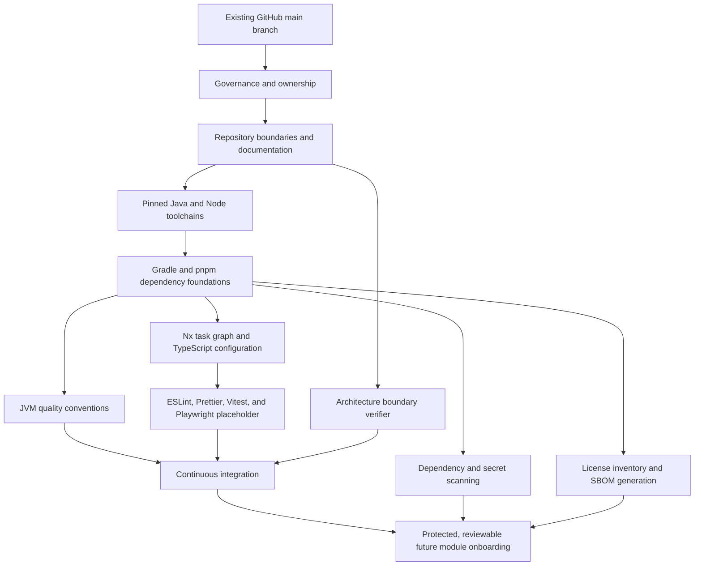

# Foundation Dependency Graph

Phase P1 capabilities are intentionally ordered so later controls rely on stable earlier contracts.

## Dependency rules

- Governance precedes automation because controls require owners and review authority.
- Boundaries precede module tooling because the project graph needs stable locations.
- Toolchain pins precede lock files and reproducible checks.
- Local checks precede CI so developers can reproduce failures.
- Security and evidence workflows depend on locked dependency inputs.
- Future module onboarding depends on every P1 capability and remains blocked until separate
  architecture approval.
