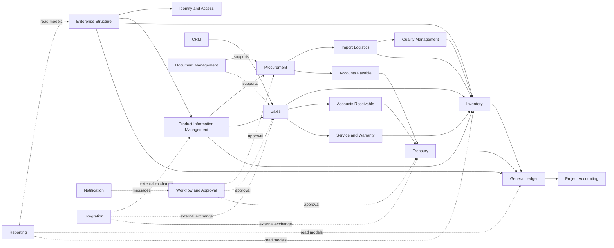

# Context Map

## Mermaid Context Map

## Dependency Table

| From                           | To                             | Relationship             | Reason                                                  |
| ------------------------------ | ------------------------------ | ------------------------ | ------------------------------------------------------- |
| All contexts                   | Enterprise Structure           | Customer/Supplier        | Contexts consume scope ownership.                       |
| Identity and Access            | Enterprise Structure           | Conformist               | Access scopes conform to structure.                     |
| Product Information Management | Enterprise Structure           | Customer/Supplier        | Product availability is scoped by company where needed. |
| Procurement                    | Product Information Management | Customer/Supplier        | Procurement references product truth.                   |
| Procurement                    | Import Logistics               | Customer/Supplier        | Approved POs become logistics inputs.                   |
| Import Logistics               | Inventory                      | Published Language       | Receipt readiness and landed-cost facts are published.  |
| Quality Management             | Inventory                      | Customer/Supplier        | QC decisions affect stock availability.                 |
| Sales                          | Inventory                      | Customer/Supplier        | Sales requests reservation and delivery stock actions.  |
| Sales                          | Accounts Receivable            | Published Language       | Posted invoice facts become receivable inputs.          |
| Accounts Receivable            | General Ledger                 | Published Language       | AR postings create accounting facts.                    |
| Accounts Payable               | General Ledger                 | Published Language       | AP postings create accounting facts.                    |
| Treasury                       | General Ledger                 | Published Language       | Payments and receipts create accounting facts.          |
| Workflow and Approval          | Source contexts                | Open Host Service        | Source contexts request approval decisions.             |
| Document Management            | Source contexts                | Open Host Service        | Source contexts attach and retrieve document evidence.  |
| Reporting                      | All source contexts            | Separate Ways for writes | Reporting is read-only and never owns source data.      |
| Integration                    | External systems               | Anticorruption Layer     | External data is translated before entering contexts.   |

## Data Ownership Matrix

| Data object                | Owner                          | Allowed consumers                                  | Notes                                            |
| -------------------------- | ------------------------------ | -------------------------------------------------- | ------------------------------------------------ |
| Company, branch, warehouse | Enterprise Structure           | All contexts                                       | Scope source of truth.                           |
| User, role, permission     | Identity and Access            | All secure contexts                                | Consumers use effective permissions only.        |
| Product, SKU, packaging    | Product Information Management | Procurement, Sales, Inventory, Service, Website    | No local product copies as truth.                |
| Supplier                   | Procurement                    | AP, Import Logistics, Reporting                    | Business Partner consolidation is OPEN DECISION. |
| Customer                   | Sales / CRM                    | AR, Service, Reporting                             | Owner split is OPEN DECISION.                    |
| Stock ledger               | Inventory                      | Sales, Procurement, Service, Accounting, Reporting | Balances derived from movements.                 |
| Inspection result          | Quality Management             | Inventory, Procurement, Service                    | Release/block decisions are published.           |
| Sales order                | Sales                          | Inventory, AR, Service, Reporting                  | Sales owns commercial commitment.                |
| Purchase order             | Procurement                    | Import Logistics, AP, Inventory, Reporting         | Procurement owns supplier commitment.            |
| Journal entry              | General Ledger                 | Reporting, Project Accounting, Audit               | Posted journals immutable.                       |
| Payment/receipt            | Treasury                       | AR, AP, GL, Reporting                              | Execution requires approval.                     |
| Document metadata          | Document Management            | Source contexts, Audit                             | File storage technology is OPEN DECISION.        |
| Approval request           | Workflow and Approval          | Source contexts, Notification, Audit               | Source object remains with source context.       |

## Event-Flow Matrix

| Producer                       | Event                 | Primary consumers                                  | Interaction type |
| ------------------------------ | --------------------- | -------------------------------------------------- | ---------------- |
| Enterprise Structure           | CompanyCreated        | Identity, Product, GL, Reporting                   | Asynchronous     |
| Product Information Management | ProductCreated        | Procurement, Sales, Inventory, Website Integration | Asynchronous     |
| Procurement                    | PurchaseOrderApproved | Import Logistics, AP, Reporting                    | Asynchronous     |
| Import Logistics               | CustomsReleased       | Inventory, Accounting, Reporting                   | Asynchronous     |
| Quality Management             | InspectionFailed      | Inventory, Procurement, Service                    | Asynchronous     |
| Inventory                      | GoodsReceived         | QC, Accounting, Reporting                          | Asynchronous     |
| Sales                          | SalesOrderApproved    | Inventory, AR, Workflow, Reporting                 | Asynchronous     |
| Sales                          | CustomerInvoicePosted | AR, GL, Reporting                                  | Asynchronous     |
| Treasury                       | PaymentReceived       | AR, GL, Reporting                                  | Asynchronous     |
| Accounts Payable               | SupplierInvoicePosted | Treasury, GL, Reporting                            | Asynchronous     |
| General Ledger                 | JournalEntryPosted    | Project Accounting, Reporting, Audit               | Asynchronous     |
| Workflow and Approval          | ApprovalCompleted     | Source context, Notification, Audit                | Asynchronous     |

## Synchronous vs Asynchronous Interaction Matrix

| Interaction                             | Preferred style                        | Rationale                                           |
| --------------------------------------- | -------------------------------------- | --------------------------------------------------- |
| Permission check during command         | Synchronous query                      | Command cannot proceed without authorization.       |
| Product lookup during PO or SO entry    | Synchronous query                      | User needs immediate validation.                    |
| Stock availability check                | Synchronous query                      | Reservation decision needs current availability.    |
| Approval result notification            | Asynchronous event                     | Source context can react to decision.               |
| Accounting posting from source document | Asynchronous event with reconciliation | Source document and ledger should remain decoupled. |
| Reporting refresh                       | Asynchronous projection                | Reporting must not own transactions.                |
| External website sync                   | Asynchronous integration job           | External failures must not block core posting.      |
| Bank statement import                   | Asynchronous integration job           | Requires retry and reconciliation.                  |

## OPEN DECISION

- No unavoidable circular dependency is approved.
- Confirm whether customer and supplier master data need a shared Business Partner context.
- Confirm whether accounting posting from source contexts is synchronous at posting time or
  event-driven with strict reconciliation.
