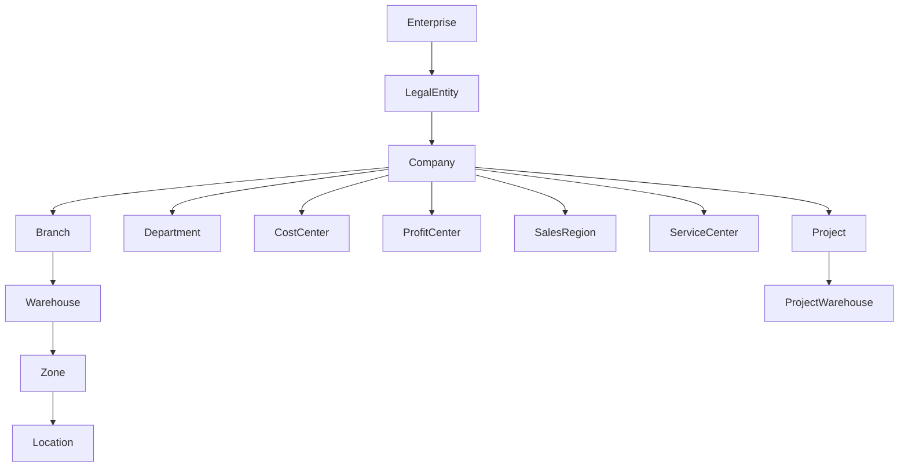
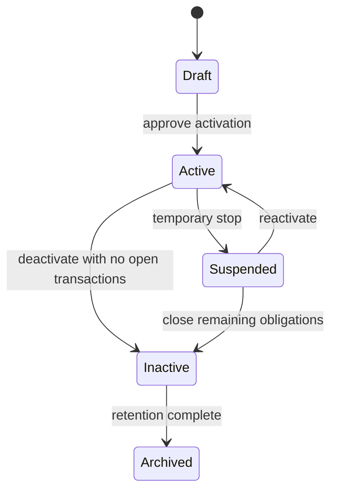

# Organization Model

## Hierarchy

## Ownership

| Node           | Business owner        | Purpose                                             | Can transact?                   |
| -------------- | --------------------- | --------------------------------------------------- | ------------------------------- |
| Enterprise     | CEO                   | Group-level reporting and governance.               | No                              |
| Legal Entity   | CEO / Finance Manager | Statutory and ledger ownership boundary.            | Yes, through companies          |
| Company        | CEO / Finance Manager | Operating transaction owner.                        | Yes                             |
| Branch         | Branch Manager        | Local sales, service, warehouse, or admin activity. | Yes, when active                |
| Warehouse      | Warehouse Manager     | Stock custody and movement boundary.                | Yes, through Inventory          |
| Zone           | Warehouse Manager     | Physical warehouse subdivision.                     | No direct financial transaction |
| Location       | Warehouse Operator    | Bin/shelf/location stock placement.                 | No direct financial transaction |
| Project        | Project Manager       | Project reporting and optional stock/cost boundary. | Yes, when approved              |
| Department     | HR Manager            | Organization and employee assignment.               | No direct financial transaction |
| Cost Center    | Finance Manager       | Management accounting dimension.                    | Used on postings                |
| Profit Center  | Finance Manager       | Profitability reporting dimension.                  | Used on postings                |
| Sales Region   | Sales Manager         | Sales territory grouping.                           | No direct financial transaction |
| Service Center | Service Manager       | Service operation grouping.                         | Yes, through Service            |

## Scope Inheritance

- Enterprise scope can read all approved lower scopes.
- Legal entity scope limits statutory financial data and period close.
- Company scope limits transactions, accounting ownership, numbering, and reporting.
- Branch scope limits operational visibility where configured.
- Warehouse scope limits stock custody and warehouse operations.
- Project scope limits project ledger, project warehouse, and project reporting where configured.

## Activation and Deactivation

Rules:

- A child node cannot become active when its parent is inactive.
- Deactivation requires no open transactions, no unresolved stock movements, and no pending
  approvals unless an approved exception exists.
- Historical records keep their original scope references after deactivation.
- Hard deletion is not allowed after transactional use.

## Cross-Company Operations

Cross-company operations require:

- Source company and destination company.
- Approved inter-company policy.
- Accounting impact in both company ledgers.
- Transfer pricing or cost basis rule.
- Tax and statutory rule review.

OPEN DECISION: Final inter-company accounting and tax treatment by country.

## Branch-to-Company Relationships

- A branch belongs to exactly one company at a time.
- Branch reassignment after transactions is not allowed without migration approval.
- Branch visibility inherits company visibility unless explicitly restricted.

## Warehouse-to-Branch Relationships

- A warehouse belongs to one branch unless a central-company warehouse model is approved.
- Warehouse stock is owned by one company.
- Branch warehouses may serve local sales, service, and transfer needs.

## Project Warehouse Rules

- A project warehouse is linked to one project and one owning company.
- Project stock must remain reportable by project and by company.
- Project warehouse use for non-project stock is OPEN DECISION.
- Transfers between project and central warehouses require approval and audit.

## Central Warehouse Rules

- A central warehouse may serve multiple branches of the same company.
- Multi-company central warehouse operation is OPEN DECISION.
- Central warehouse availability can feed branch reservation logic where approved.

## Company Switching

- Users may switch active company only when assigned permission scope allows it.
- The active company controls default numbering, currency, branch list, warehouse list, and
  reporting scope.
- Cross-company reporting requires explicit permission.

## Data Visibility

| Scope        | Default visibility                                                   |
| ------------ | -------------------------------------------------------------------- |
| Enterprise   | All approved companies and legal entities.                           |
| Legal Entity | Companies and branches under that legal entity.                      |
| Company      | Branches, warehouses, projects, and transactions under that company. |
| Branch       | Branch-owned operational transactions.                               |
| Warehouse    | Warehouse stock and movement operations.                             |
| Project      | Project ledger, stock, and documents.                                |

## Reporting Scope

Reports must declare their scope dimension:

- Enterprise consolidated.
- Legal entity statutory.
- Company operational.
- Branch operational.
- Warehouse stock.
- Project profitability.
- Cost center expense.

OPEN DECISION: Consolidation currency, elimination rules, and statutory consolidation packs.
