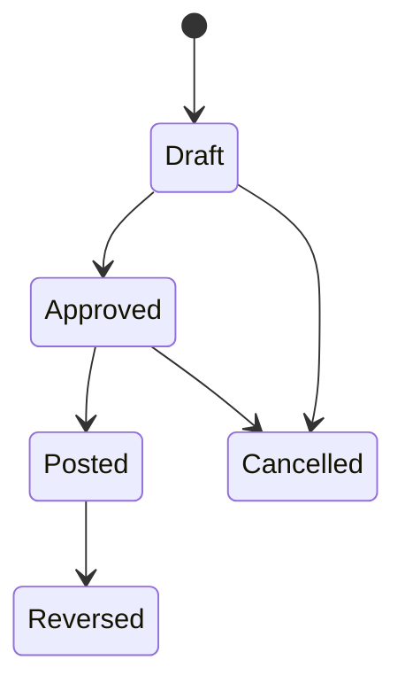

# Financial Domains

## Accounting Principles

Newland ERP financial design is founded on double-entry accounting.

Rules:

- Every posted journal entry must balance debits and credits.
- Posted journals are immutable.
- Corrections use reversal and replacement, not deletion or silent update.
- Source documents may remain in operational contexts; accounting owns posted journal truth.
- Accounting periods control posting windows.
- Multi-company ledgers are required.
- Project sub-ledgers must reconcile to the company ledger.
- Cost centers classify expense and profitability reporting.
- Chart of accounts is hierarchical.
- Currency amounts must track transaction currency, company base currency, and reporting currency
  where applicable.
- Monetary precision and rounding must be explicit by currency.
- Realized and unrealized FX differences require accounting policy.
- Inventory valuation integration points must be defined before inventory cost posting.
- Accounts Receivable owns customer balances.
- Accounts Payable owns supplier balances.
- Treasury owns payment execution and collection.
- Bank reconciliation and cashbox reconciliation must publish accounting-relevant facts.
- Checks have lifecycle status and must reconcile to bank/cash events.
- Audit trail is mandatory for posting, approval, reversal, and period close.

OPEN DECISION:

- Country-specific tax rules for UAE, Iran, Iraq, China, and future GCC operations.
- Statutory chart-of-accounts requirements.
- Fiscal calendar per legal entity.
- Base currency per legal entity and group reporting currency.
- Inventory valuation method.
- FX rate source and revaluation policy.

## General Ledger

Owned records:

- Ledger account.
- Journal entry.
- Journal line.
- Accounting period.
- Posting batch.

Lifecycle:

## Accounts Receivable

Responsibilities:

- Customer invoice accounting impact.
- Receipt allocation.
- Aging.
- Credit exposure inputs.
- Customer balance reporting.

OPEN DECISION: Credit-limit calculation and blocked customer policy.

## Accounts Payable

Responsibilities:

- Supplier invoice accounting impact.
- Payment allocation.
- Aging.
- Duplicate invoice prevention.
- Supplier balance reporting.

OPEN DECISION: Supplier invoice matching rules and tolerance thresholds.

## Treasury, Banking, Checks, and Cashbox

Responsibilities:

- Payment approval and execution.
- Receipt recording and allocation.
- Bank-account operations.
- Bank-statement reconciliation.
- Cashbox open, movement, count, and close.
- Received and issued check lifecycle.

Rules:

- Payments require approval before execution.
- Cashbox close requires a counted balance and audit record.
- Bank reconciliation must preserve unmatched items.
- Check cancellation, return, maturity, and deposit require audit.

OPEN DECISION: Bank integration format, payment gateway scope, and check handling rules by country.

## Project Accounting

Responsibilities:

- Project ledger lines.
- Project cost and revenue classification.
- Project warehouse accounting links.
- Project profitability reporting.

Rules:

- Project postings must reconcile with the company GL.
- Project warehouse movements must be visible to both project and inventory reporting.

OPEN DECISION: Project budget control and project revenue recognition policy.

## Fixed Assets

Responsibilities:

- Asset register.
- Capitalization.
- Depreciation.
- Disposal.

OPEN DECISION: Depreciation methods, asset categories, capitalization thresholds, and country
statutory asset reporting.
