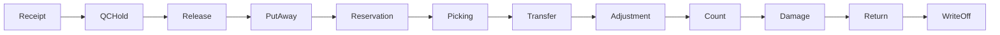
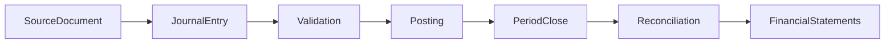
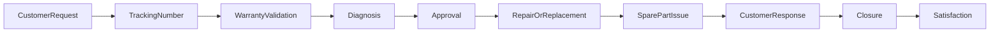
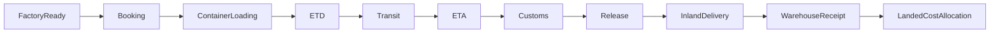

# Process Map

This document defines the required end-to-end business processes. It does not implement workflows.

## A. Procure-to-Pay

```mermaid
flowchart LR
  Demand --> RFQ --> SupplierQuotation --> Comparison --> Proforma --> Approval --> PO
  PO --> ProductionFollowUp --> QC --> Shipment --> Customs --> WarehouseReceipt
  WarehouseReceipt --> SupplierInvoice --> Payment --> Reconciliation
```

| Field               | Definition                                                                                                                                                                                                                                    |
| ------------------- | --------------------------------------------------------------------------------------------------------------------------------------------------------------------------------------------------------------------------------------------- |
| Trigger             | Approved demand, replenishment need, project need, or management purchase request.                                                                                                                                                            |
| Preconditions       | Active company, active supplier, active products, purchasing permissions, currency configured.                                                                                                                                                |
| Actors              | Procurement User, Procurement Manager, QC Inspector, Warehouse Operator, Accountant, Finance Manager.                                                                                                                                         |
| Steps               | Capture demand; request quotation; record supplier quotations; compare; record proforma; approve; issue PO; follow production; inspect/QC; arrange shipment; clear customs; receive goods; post supplier invoice; execute payment; reconcile. |
| Decisions           | Supplier selection, approval requirement, QC pass/fail, customs release, invoice match, payment approval.                                                                                                                                     |
| Exceptions          | Supplier rejects, quotation expired, PO revision, shipment delay, QC failure, customs hold, partial receipt, invoice mismatch, payment failure.                                                                                               |
| Required documents  | RFQ, supplier quotation, comparison, proforma, purchase order, packing list, shipment docs, customs docs, goods receipt, supplier invoice, payment evidence.                                                                                  |
| Statuses            | Draft, Submitted, Approved, Ordered, In Production, Ready, Shipped, Customs Hold, Received, Invoiced, Paid, Reconciled, Cancelled.                                                                                                            |
| Approvals           | PO approval, landed-cost approval, invoice approval, payment approval.                                                                                                                                                                        |
| Accounting impact   | Supplier invoice creates payable; landed costs may capitalize or expense per OPEN DECISION; payment clears payable; FX differences OPEN DECISION.                                                                                             |
| Inventory impact    | Goods receipt posts stock into warehouse or QC hold; QC release makes stock available; rejected goods remain blocked or returned.                                                                                                             |
| Events              | SupplierQuotationAccepted, PurchaseOrderApproved, ShipmentBooked, ContainerLoaded, CustomsReleased, GoodsReceived, InspectionFailed, StockReleased, SupplierInvoicePosted, PaymentExecuted.                                                   |
| Audit requirements  | Approval decisions, supplier selection, PO revisions, receipt variance, invoice match, payment execution.                                                                                                                                     |
| Acceptance criteria | PO cannot be approved without supplier and lines; receipt cannot post to inactive warehouse; supplier invoice mismatch is visible; payment requires approval.                                                                                 |

## B. Order-to-Cash

| Field               | Definition                                                                                                                                                                                         |
| ------------------- | -------------------------------------------------------------------------------------------------------------------------------------------------------------------------------------------------- |
| Trigger             | Customer inquiry, lead conversion, repeat order, website request, or sales opportunity.                                                                                                            |
| Preconditions       | Active customer, active company/branch, active products, valid pricing policy OPEN DECISION, access permission.                                                                                    |
| Actors              | CRM User, Sales User, Sales Manager, Warehouse Operator, Accountant, Finance Manager, Service User.                                                                                                |
| Steps               | Capture lead; qualify opportunity; prepare quotation; approve quotation if needed; create sales order; run credit check; reserve stock; pick; deliver; invoice; collect; handle return; follow up. |
| Decisions           | Quote approval, discount approval, credit approval, stock reservation, delivery approval, return acceptance.                                                                                       |
| Exceptions          | Customer blocked, credit limit exceeded, insufficient stock, reservation expired, partial delivery, invoice dispute, payment failure, return rejected.                                             |
| Required documents  | Lead notes, quotation, sales order, reservation, pick list, delivery note, customer invoice, receipt, return request.                                                                              |
| Statuses            | Draft, Quoted, Approved, Ordered, Credit Hold, Reserved, Picked, Delivered, Invoiced, Collected, Returned, Closed, Cancelled.                                                                      |
| Approvals           | Quotation discount, sales order, credit override, return approval, invoice posting where configured.                                                                                               |
| Accounting impact   | Customer invoice creates receivable; receipt clears receivable; returns create reversal or credit memo per OPEN DECISION.                                                                          |
| Inventory impact    | Reservation reduces availability; delivery posts goods issue; return posts goods receipt or blocked stock.                                                                                         |
| Events              | SalesOrderApproved, InventoryReserved, DeliveryPosted, CustomerInvoicePosted, PaymentReceived.                                                                                                     |
| Audit requirements  | Price/discount decisions, credit override, reservation release, delivery posting, invoice posting, return decision.                                                                                |
| Acceptance criteria | Sales cannot reserve inactive product; delivery cannot post unavailable stock; credit override is audited; invoice references delivery/source.                                                     |

## C. Inventory Lifecycle

| Field               | Definition                                                                                                                                              |
| ------------------- | ------------------------------------------------------------------------------------------------------------------------------------------------------- |
| Trigger             | Purchase receipt, sales delivery, transfer request, service issue, return, count, damage discovery, adjustment request.                                 |
| Preconditions       | Active product, company, warehouse, and location; posting permission; valid unit conversion.                                                            |
| Actors              | Warehouse Operator, Warehouse Manager, QC Inspector, Sales User, Service User, Accountant.                                                              |
| Steps               | Receive; place on QC hold; release or block; put away; reserve; pick; transfer; adjust; count; classify damage; receive return; write off.              |
| Decisions           | QC pass/fail, reservation allocation, transfer approval, adjustment approval, count variance approval, write-off approval.                              |
| Exceptions          | Quantity mismatch, wrong warehouse, failed QC, blocked product, negative stock attempt, unit conversion error, missing serial/lot where required.       |
| Required documents  | Goods receipt, QC result, put-away task, reservation, pick list, transfer, adjustment, count sheet, damage report, return document, write-off approval. |
| Statuses            | Received, QC Hold, Released, Put Away, Reserved, Picked, Transferred, Counted, Damaged, Returned, Written Off.                                          |
| Approvals           | Adjustment, write-off, transfer where configured, QC override.                                                                                          |
| Accounting impact   | Posted movements may trigger valuation entries once valuation method is approved.                                                                       |
| Inventory impact    | All impacts are ledger movements; no direct balance edits.                                                                                              |
| Events              | GoodsReceived, InspectionFailed, StockReleased, InventoryReserved, InventoryTransferred, InventoryAdjusted.                                             |
| Audit requirements  | Movement poster, source document, warehouse/location, quantity, unit, status, reversal reference.                                                       |
| Acceptance criteria | Balance is derivable from movements; inactive warehouse cannot transact; adjustment approval required; posted movement immutable.                       |

## D. Record-to-Report

| Field               | Definition                                                                                                                                     |
| ------------------- | ---------------------------------------------------------------------------------------------------------------------------------------------- |
| Trigger             | Source document from sales, procurement, inventory, treasury, payroll, asset, or manual accounting request.                                    |
| Preconditions       | Active company ledger, open period, active accounts, currency/rate configured, posting permission.                                             |
| Actors              | Accountant, Finance Manager, Auditor, CEO.                                                                                                     |
| Steps               | Receive source fact; prepare journal; validate balance and dimensions; approve if required; post; reconcile; close period; produce statements. |
| Decisions           | Account mapping, approval requirement, posting period, reversal requirement, reconciliation treatment.                                         |
| Exceptions          | Unbalanced entry, closed period, missing exchange rate, inactive account, invalid cost center/project, duplicate source posting.               |
| Required documents  | Source document, journal entry, approval record, reconciliation evidence, period close checklist, financial statement.                         |
| Statuses            | Draft, Validated, Approved, Posted, Reversed, Closed.                                                                                          |
| Approvals           | Manual journal approval, period close approval, reversal approval.                                                                             |
| Accounting impact   | GL is updated only by posted balanced journals.                                                                                                |
| Inventory impact    | Inventory valuation entries are integration points, not defined until valuation policy is approved.                                            |
| Events              | JournalEntryPosted, AccountingPeriodClosed.                                                                                                    |
| Audit requirements  | Preparer, approver, poster, source, account, dimension, amount, currency, reversal link.                                                       |
| Acceptance criteria | Posted journal is immutable; reversal preserves audit; closed period blocks new posting except approved reopening OPEN DECISION.               |

## E. Warranty and Service

| Field               | Definition                                                                                                                                                          |
| ------------------- | ------------------------------------------------------------------------------------------------------------------------------------------------------------------- |
| Trigger             | Customer service request, warranty claim, repair request, complaint, or post-sale follow-up.                                                                        |
| Preconditions       | Customer or product reference captured; service center active; warranty policy OPEN DECISION.                                                                       |
| Actors              | Service User, Service Manager, Warehouse Operator, QC Inspector, Customer, Sales User.                                                                              |
| Steps               | Create ticket; assign tracking number; validate warranty; diagnose; approve repair/replacement; issue spare part; respond to customer; close; collect satisfaction. |
| Decisions           | Warranty valid/invalid, paid service requirement, repair vs replacement, spare part approval, closure acceptance.                                                   |
| Exceptions          | Missing proof, expired warranty, unavailable spare part, repeated failure, customer rejection, replacement stock unavailable.                                       |
| Required documents  | Service ticket, warranty evidence, diagnosis, approval, spare-part issue, repair/replacement result, customer response.                                             |
| Statuses            | Open, Validating, Warranty Valid, Warranty Rejected, Diagnosing, Awaiting Approval, Repairing, Replacing, Responded, Closed, Cancelled.                             |
| Approvals           | Warranty override, replacement, spare-part issue, write-off where needed.                                                                                           |
| Accounting impact   | Paid service invoice, warranty cost, replacement cost, and write-off policy are OPEN DECISION.                                                                      |
| Inventory impact    | Spare-part issue and replacement use inventory movements; returned item may enter QC hold or blocked stock.                                                         |
| Events              | ServiceTicketCreated, WarrantyValidated, InventoryAdjusted.                                                                                                         |
| Audit requirements  | Warranty decision, diagnosis, part issue, customer communication, closure reason.                                                                                   |
| Acceptance criteria | Ticket has tracking number; closure requires outcome; spare-part issue is traceable; warranty override is audited.                                                  |

## F. Import Logistics

| Field               | Definition                                                                                                                                                                    |
| ------------------- | ----------------------------------------------------------------------------------------------------------------------------------------------------------------------------- |
| Trigger             | Supplier confirms factory readiness or shipment planning begins from approved purchase order.                                                                                 |
| Preconditions       | Approved PO, supplier and product records, port/carrier setup, import permission.                                                                                             |
| Actors              | Procurement User, Import Manager, Carrier/Forwarder, QC Inspector, Warehouse Operator, Accountant.                                                                            |
| Steps               | Confirm factory ready; book shipment; load container; record ETD; track transit; record ETA; clear customs; release; inland deliver; receive warehouse; allocate landed cost. |
| Decisions           | Carrier selection, container plan, customs release, inland delivery, landed-cost approval.                                                                                    |
| Exceptions          | Factory delay, booking failure, container short/over load, transit delay, customs hold, damaged goods, missing documents, cost variance.                                      |
| Required documents  | PO, proforma, packing list, booking, container list, bill of lading or equivalent OPEN DECISION, customs documents, warehouse receipt, landed-cost evidence.                  |
| Statuses            | Factory Ready, Booked, Loaded, Departed, In Transit, Arrived, Customs Hold, Released, Delivered, Received, Cost Allocated, Closed.                                            |
| Approvals           | Carrier/cost approval, customs release acceptance, landed-cost allocation approval.                                                                                           |
| Accounting impact   | Landed-cost posting affects inventory valuation or expense per OPEN DECISION.                                                                                                 |
| Inventory impact    | Goods remain in transit until warehouse receipt; receipt may place goods on QC hold.                                                                                          |
| Events              | ShipmentBooked, ContainerLoaded, CustomsReleased, GoodsReceived, LandedCostPosted.                                                                                            |
| Audit requirements  | Shipment status changes, container contents, customs release, cost allocation, receipt variance.                                                                              |
| Acceptance criteria | Shipment references approved PO; container cannot load before booking; receipt references shipment/container; landed cost is traceable.                                       |
