# Numbering and Status Architecture

## Configurable Numbering

Final formats are not hard-coded in P2. Numbering is configured by document type, company, branch,
fiscal year, reset policy, and sequence policy.

Pattern tokens:

- `{companyPrefix}`
- `{branchPrefix}`
- `{fiscalYear}`
- `{documentType}`
- `{sequence}`
- `{legacyNumber}`

Examples are illustrative only:

- `{companyPrefix}-{documentType}-{fiscalYear}-{sequence}`
- `{companyPrefix}-{branchPrefix}-{documentType}-{fiscalYear}-{sequence}`

| Document | Meaning            | Draft numbering                        | Posted numbering                        | Gap policy                                | Cancellation                 | Manual/legacy exception           |
| -------- | ------------------ | -------------------------------------- | --------------------------------------- | ----------------------------------------- | ---------------------------- | --------------------------------- |
| PO       | Purchase Order     | Temporary draft number allowed         | Final on approval                       | OPEN DECISION                             | Cancel keeps number          | Legacy supplier reference allowed |
| SO       | Sales Order        | Temporary draft number allowed         | Final on approval                       | OPEN DECISION                             | Cancel keeps number          | Legacy import allowed             |
| GRN      | Goods Receipt Note | Temporary receipt draft                | Final on posting                        | No reuse after posting                    | Reversal uses reference      | Legacy receipt number allowed     |
| GIN      | Goods Issue Note   | Temporary issue draft                  | Final on posting                        | No reuse after posting                    | Reversal uses reference      | Legacy issue number allowed       |
| TRF      | Inventory Transfer | Temporary transfer draft               | Final on posting/dispatch OPEN DECISION | No reuse after posting                    | Cancel before posting only   | Legacy transfer number allowed    |
| INV      | Customer Invoice   | Draft invoice number OPEN DECISION     | Final on posting                        | Gap policy country-specific OPEN DECISION | Credit/reversal, no deletion | Legacy invoice number restricted  |
| PINV     | Supplier Invoice   | Supplier reference plus internal draft | Final on posting                        | No reuse after posting                    | Reversal/credit              | Supplier invoice number preserved |
| PAY      | Payment            | Draft payment request                  | Final on execution                      | No reuse after execution                  | Void with audit              | Bank reference allowed            |
| REC      | Receipt            | Draft receipt                          | Final on posting                        | No reuse after posting                    | Void/reverse with audit      | Bank/check reference allowed      |
| JV       | Journal Voucher    | Draft journal number                   | Final on posting                        | No reuse after posting                    | Reversal journal             | Legacy journal number restricted  |
| SHP      | Shipment           | Draft shipment reference               | Final on booking                        | OPEN DECISION                             | Cancel keeps audit           | Carrier ref allowed               |
| CNT      | Container          | Draft container line                   | Final on loading                        | OPEN DECISION                             | Cancel before release        | Carrier/container ref stored      |
| QC       | Quality Inspection | Draft inspection request               | Final on result posting                 | No reuse after posting                    | Correct with new result      | Legacy QC ref allowed             |
| SRV      | Service Ticket     | Final on creation                      | Same tracking number                    | No reuse                                  | Cancel/close with reason     | External ticket ref allowed       |
| WRN      | Warranty Claim     | Draft claim                            | Final on validation                     | No reuse                                  | Reject/close with reason     | External warranty ref allowed     |

Rules:

- Draft and posted sequences may be separate.
- Posted numbers are never reused.
- Reset policy can be never, fiscal year, company fiscal year, or branch fiscal year.
- Manual numbers require permission, reason, uniqueness validation, and audit.
- Imported legacy numbers are stored as external references unless migration policy approves
  primary-number preservation.

## State Machine Summary

Each state machine lists states, allowed transitions, actor permission, preconditions, side effects,
reversal behavior, audit event, and terminal states.

### Product

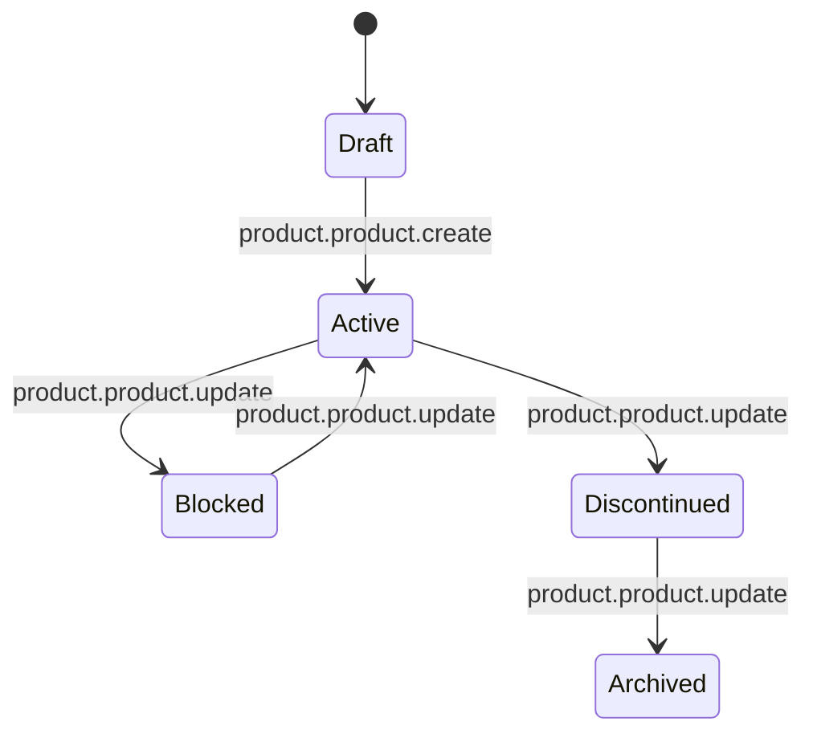

Preconditions: required product identity, category, unit, and duplicate check.  
Side effects: ProductCreated or ProductPackagingChanged event.  
Reversal: return to Blocked or Active where no conflicting transactions exist.  
Terminal states: Archived.  
Audit event: product status changed.

### Customer

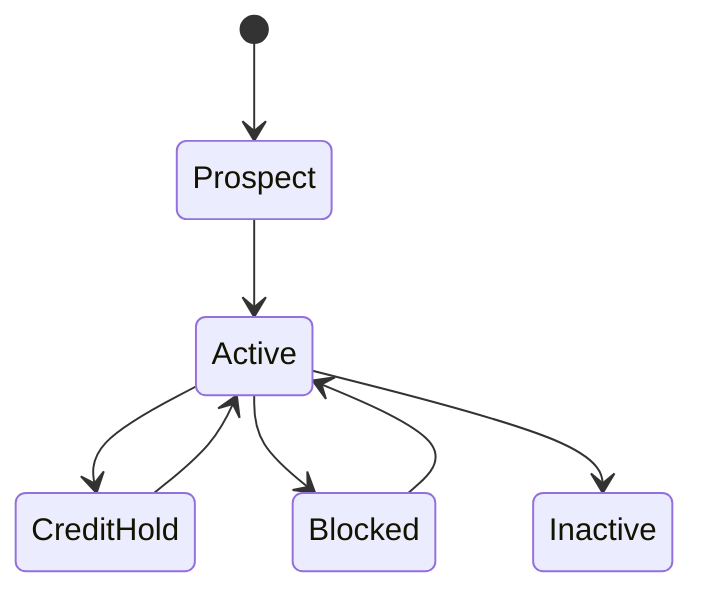

Permission: sales.customer.manage OPEN DECISION.  
Preconditions: customer identity and scope.  
Side effects: credit checks and sales eligibility change.  
Reversal: reactivation with approval.  
Terminal states: Inactive.  
Audit event: customer status changed.

### Supplier

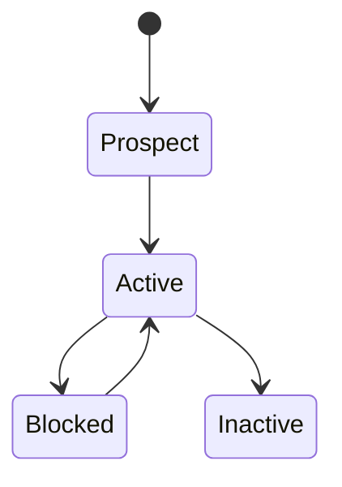

Permission: procurement.supplier.manage OPEN DECISION.  
Preconditions: supplier identity and payment settings where required.  
Side effects: procurement eligibility change.  
Reversal: unblock/reactivate with approval.  
Terminal states: Inactive.  
Audit event: supplier status changed.

### Purchase Order

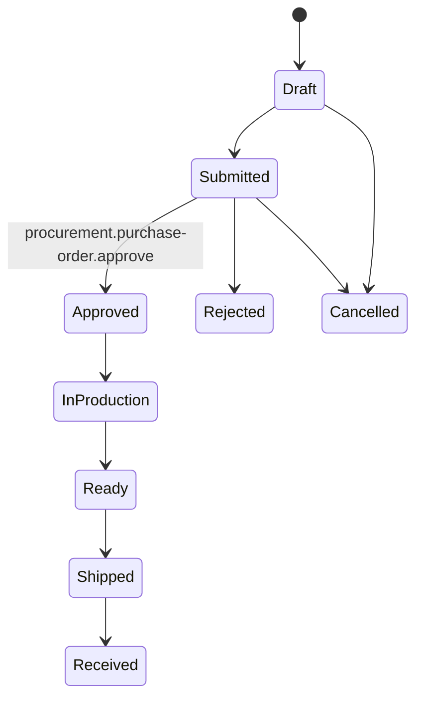

Preconditions: active supplier, products, company, currency, approval rules.  
Side effects: PurchaseOrderApproved event and procurement commitment.  
Reversal: approved PO requires revision or cancellation policy OPEN DECISION.  
Terminal states: Received, Rejected, Cancelled.  
Audit event: purchase order status changed.

### Sales Order

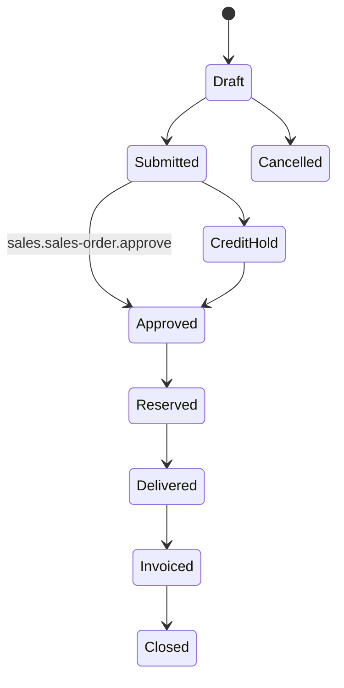

Preconditions: active customer, products, stock check, credit check.  
Side effects: SalesOrderApproved, InventoryReserved, DeliveryPosted.  
Reversal: cancel before delivery; return/credit after delivery.  
Terminal states: Closed, Cancelled.  
Audit event: sales order status changed.

### Shipment

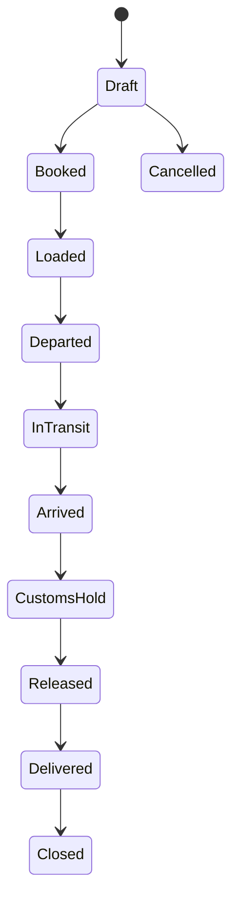

Permission: logistics.shipment.manage OPEN DECISION.  
Preconditions: approved PO, carrier/port readiness.  
Side effects: ShipmentBooked, ContainerLoaded, CustomsReleased.  
Reversal: cancel before loaded; correction after loading requires audit.  
Terminal states: Closed, Cancelled.  
Audit event: shipment status changed.

### Container

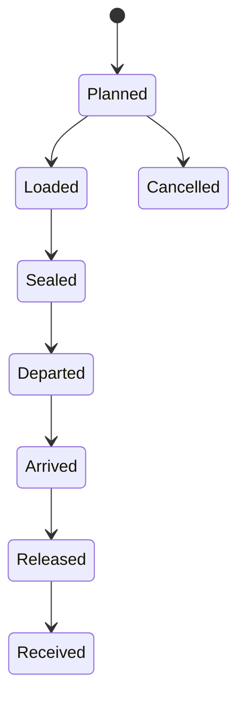

Permission: logistics.container.manage OPEN DECISION.  
Preconditions: shipment booked.  
Side effects: container tracking and receipt readiness.  
Reversal: correction requires reason after loaded.  
Terminal states: Received, Cancelled.  
Audit event: container status changed.

### Goods Receipt

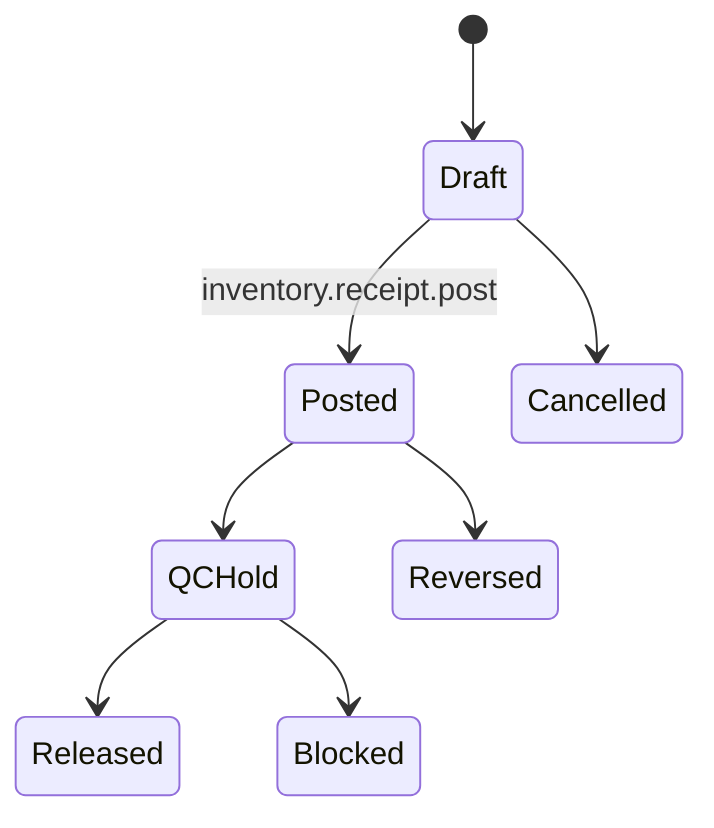

Preconditions: active warehouse/product and valid source.  
Side effects: GoodsReceived and stock ledger movement.  
Reversal: reversal movement, not deletion.  
Terminal states: Released, Blocked, Reversed, Cancelled.  
Audit event: goods receipt status changed.

### Inventory Transfer

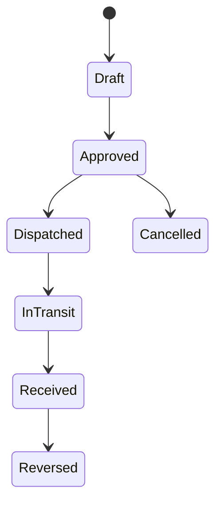

Permission: inventory.transfer.post.  
Preconditions: available stock, active source/destination.  
Side effects: InventoryTransferred event and stock movement.  
Reversal: reversal transfer or adjustment with approval.  
Terminal states: Received, Cancelled, Reversed.  
Audit event: transfer status changed.

### Inspection

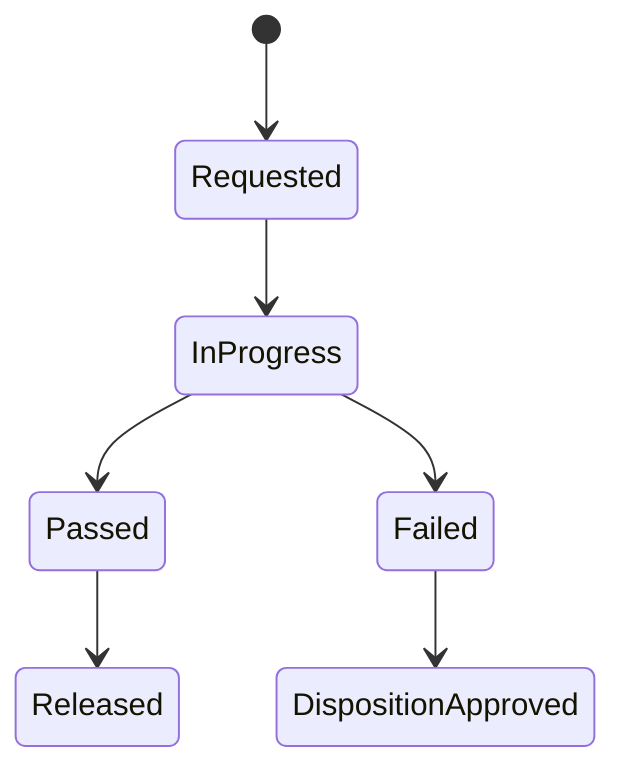

Permission: quality.inspection.post OPEN DECISION.  
Preconditions: receipt or service source.  
Side effects: InspectionFailed or StockReleased.  
Reversal: corrected inspection result with audit.  
Terminal states: Released, DispositionApproved.  
Audit event: inspection result posted.

### Service Ticket

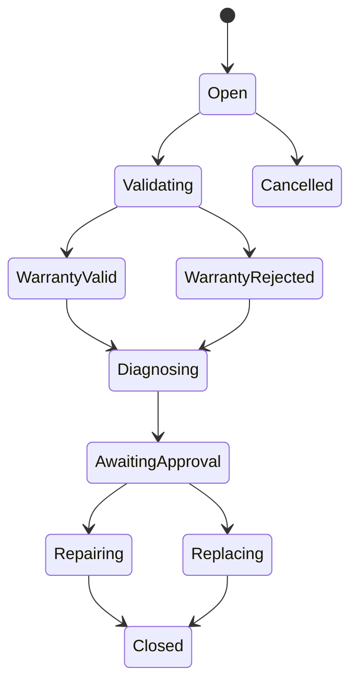

Permission: service.ticket.close.  
Preconditions: customer request and service scope.  
Side effects: ServiceTicketCreated, WarrantyValidated, inventory requests.  
Reversal: reopen policy OPEN DECISION.  
Terminal states: Closed, Cancelled.  
Audit event: service ticket status changed.

### Payment

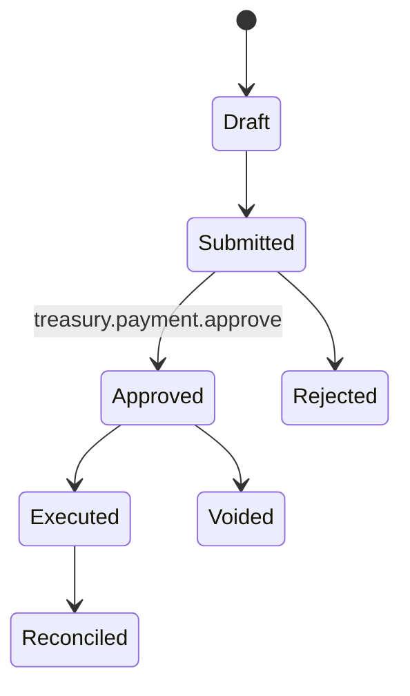

Preconditions: payable/receivable source, bank/cashbox/check instrument, approval.  
Side effects: PaymentExecuted or PaymentReceived.  
Reversal: void before reconciliation; reversal after reconciliation OPEN DECISION.  
Terminal states: Reconciled, Rejected, Voided.  
Audit event: payment status changed.

### Journal Entry

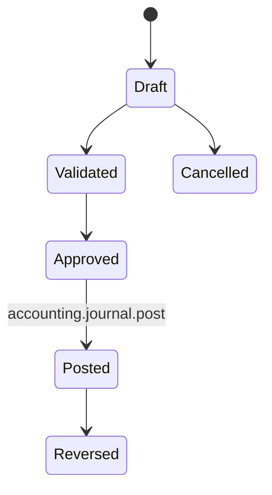

Preconditions: balanced debits/credits, open period, active accounts.  
Side effects: JournalEntryPosted event and ledger update.  
Reversal: reversal journal only.  
Terminal states: Posted, Reversed, Cancelled.  
Audit event: journal status changed.

### Accounting Period

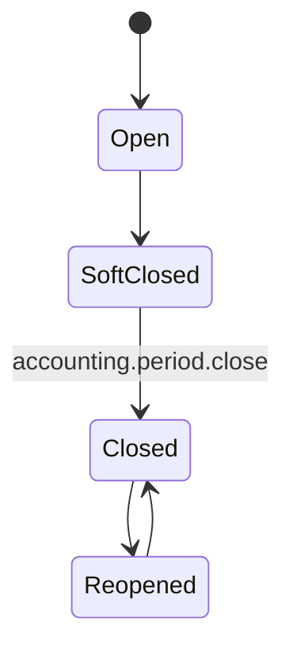

Preconditions: reconciliations and close checklist.  
Side effects: blocks postings and publishes AccountingPeriodClosed.  
Reversal: reopen requires high-privilege approval and audit.  
Terminal states: Closed unless reopened.  
Audit event: period status changed.

### Approval Request

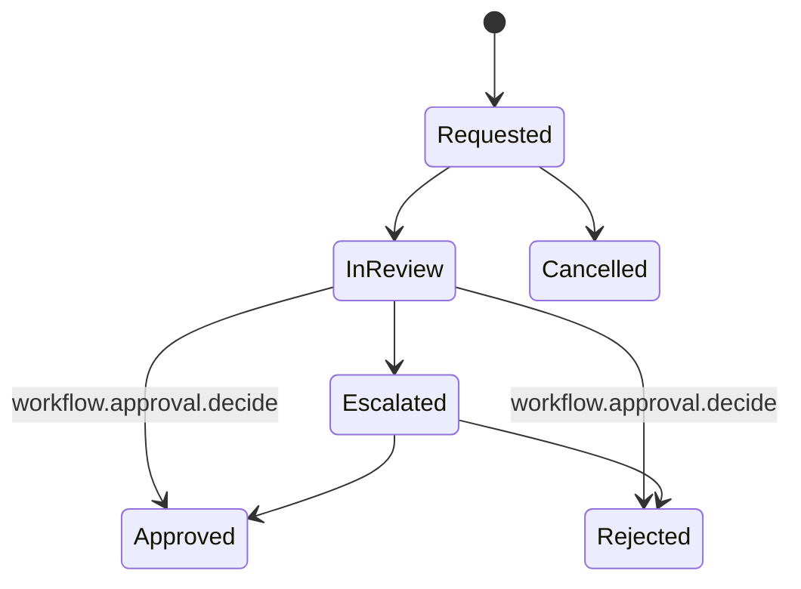

Preconditions: source context, source object, approval policy.  
Side effects: ApprovalRequested and ApprovalCompleted events.  
Reversal: new approval request required after final decision unless policy allows reopen.  
Terminal states: Approved, Rejected, Cancelled.  
Audit event: approval decision recorded.

## OPEN DECISION

- Final numbering format and gap rules by country and document type.
- Whether tax-sensitive invoice numbering must be fiscal-authority compliant per country.
- Reopen rules for accounting periods.
- Reopen rules for service tickets and approvals.
